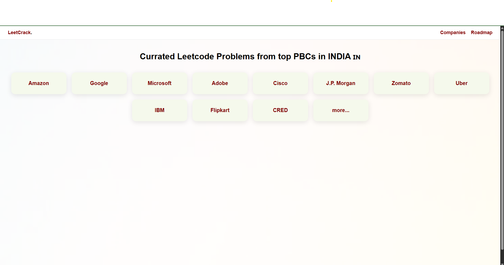

## 🌐 Live Demo

👉 [Visit LeetCrack Live](https://reaperggs.github.io/LeetCrack/)

# 📊 LeetCrack — DSA & Coding Interview Prep Tracker

LeetCrack is a lightweight, browser-based platform that helps candidates prepare for coding interviews by organizing company-wise and topic-wise problem lists, roadmaps, and resources — all in one clean, accessible place.

## 🚀 Features

- 📚 Topic-wise DSA question lists
- 🏢 Company-specific coding problem lists
- 🗺️ Roadmaps to structure your prep journey
- 🔍 Problem links redirecting directly to LeetCode
- 📊 JSON-based data handling for easy updates
- 🌐 Hosted free via GitHub Pages

## 📸 Preview

## 📂 Project Structure

leetcrack/
├── assets/
├── data/
├── js/
├── index.html
├── companies.html
├── questions.html
├── roadmap.html
├── topic-roadmap.html
├── topics.html
├── LICENSE
└── README.md

## 📄 Disclaimer ⚠️

This project includes references to coding problems and associated company tags based on publicly available resources, interview experiences, and community-curated lists.  
All rights for problem content, company tags, and problem statements belong to their respective platforms (e.g., [LeetCode](https://leetcode.com)).  

**LeetCrack is not affiliated with, endorsed by, or officially associated with LeetCode or any other interview preparation platform.**  
This repository is purely for educational and personal learning purposes.

## 📋 Credits

Some data and problem categorizations are adapted from open-source, community-contributed resources licensed under the MIT License.

## 📡 Live Demo

👉 [View LeetCrack Live](https://reaperggs.github.io/LeetCrack/)

## 📜 License

This project is open-sourced under the [MIT License](LICENSE).

